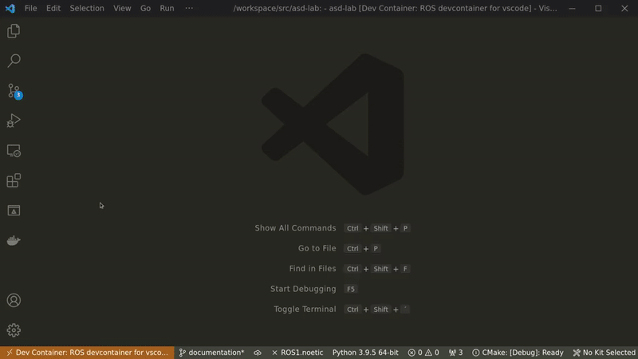

# Autonomous Systems Design - Lab

[](https://github.com/Braafisch/ASD-Labor/actions/workflows/ros.yml)
[](https://results.pre-commit.ci/latest/github/Braafisch/ASD-Labor/noetic)

A lab exercise designed to explore autonomous systems design via vehicle simulation in Gazebo and ROS. This repository has been forked from [osrf/car_demo](https://github.com/osrf/car_demo).

## Getting Started

To start, you'll have to install a ROS/Gazebo environment on your local system. There are various ways to do this. Our recommended way of creating a neatly packaged installation is through [Docker](https://www.docker.com/), [Visual Studio Code](https://code.visualstudio.com/) and the provided [devcontainer](https://code.visualstudio.com/docs/remote/create-dev-container).

### Using Devcontainer

While less performant due to lack of hardware acceleration, the devcontainer may provide a better development experience than a native install. It requires you to install [Docker Engine](https://docs.docker.com/engine/) and offers full language server support for vscode. To get up and running with the devcontainer follow these steps:

1. Install [Docker Engine](https://docs.docker.com/engine/install/), by following the steps listed for your OS/distro.

    - On Linux installation of Docker is fairly straightforward (see instructions linked above).
    - On Windows, since Docker Engine requires [WSL2](https://docs.microsoft.com/en-us/windows/wsl/install-win10), which in turn requires Hyper-V, you might run into conflicts with other virtualization software such as VMware or VirtualBox (see [details](https://docs.microsoft.com/en-us/windows/wsl/wsl2-faq#will-i-be-able-to-run-wsl-2-and-other-3rd-party-virtualization-tools-such-as-vmware--or-virtualbox-)). We recommend using the latest versions of VMware/VirtualBox (those that support Hyper-V). **If -- _and only if_ -- that's impossible you have the following three other options**:
        1. Create a Linux VM (running in VMware or VirtualBox) and install Docker inside there. (difficulty: easy)
        2. Use [Docker Machine](http://docs.docker.oeynet.com/machine/install-machine/) instead of Docker Engine and launch the Docker Daemon inside a VMware/VirtualBox VM. This way your local `docker` command will connect to a _remote_ Docker Daemon (the thing that builds, manages, and runs Docker containers) running inside a conventional VM. This option is quite involved. Only recommended for users with a thorough understanding of the Docker ecosystem. (difficulty: hard)
        3. Create a Ubuntu 20.04 LTS Linux VM (running in VMware or VirtualBox) and install ROS natively inside there. Check out the provided `Dockerfile` for required packages and use `rosdep` to install additional dependencies. (difficulty: medium)

2. In vscode install the [Remote - Containers](https://marketplace.visualstudio.com/items?itemName=ms-vscode-remote.remote-containers) extension.

3. After installation hit `Ctrl + Shift + P` and run `>Remote-Containers: Rebuild and Reopen in Container` from the command palette. This will instruct Docker to build the provided `Dockerfile`, inside of which, we will be able to develop and test our application. Installation may take a few minutes, but only has to be done once.

4. The dev-image comes with a light desktop environment (via VNC and noVNC), meaning we can run GUI applications _inside_ the container. To view them open a webbrowser of your choice, or use `>Simple Browser: Show` from the vscode command palette, and connect to `http://localhost:6080` (password: `vscode`). Alternatively, use a [VNC viewer](https://www.realvnc.com/en/connect/download/viewer/) to connect to port `5901`.

5. To build the application follow the usual steps:

    ```sh
    cd /workspace
    catkin_make
    # NOTE: use setup.zsh when using zsh
    source "devel/setup.bash"
    ```

6. Launch the demo:

    ```sh
    cd /workspace
    roslaunch car_demo demo_keyboard.launch
    ```

    You should now see several GUI applications pop up on noVNC.

## Development

The provided devcontainer comes with a few tools to help with development.



The above animation shows how to compile the project and start a simulation from inside vscode.

1. First open the noVNC page in a browser. Run `>Ports: Focus on Ports View` from the command palette and hit the preview button on Local Address `localhost:6080`. This will open a browser window inside vscode, connecting to noVNC inside the devcontainer (password: `vscode`).
2. Open the terminal panel and run the following commands:

    ```sh
    catkin_make -C /workspace # build the project
    source /workspace/devel/setup.bash # load project into ROS environment
    roslaunch car_demo demo_keyboard.launch # launch simulation
    ```

3. After starting the simulation switch back to noVNC. There you'll see the Rviz GUI. If the window is out of view, right-click the taskbar and hit `Maximize`.

## Contributors

This project is a fork of [osrf/car_demo](https://github.com/osrf/car_demo) with its respective authors. Light desktop environment script by [microsoft/vscode-dev-containers](https://github.com/microsoft/vscode-dev-containers).

Main contributors sorted by lastname:

-   Andreas Baulig
-   Wolfgang Bradfisch
-   Sungeeta Singh

Under supervision by:

-   Prof. Thao Dang
